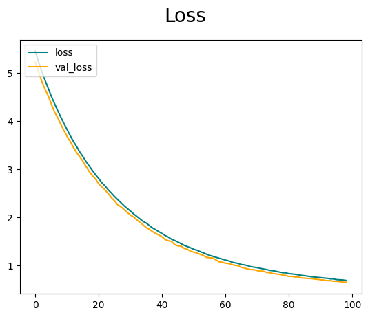
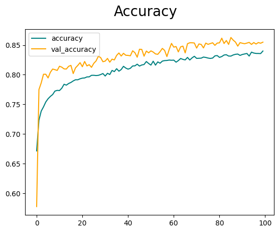
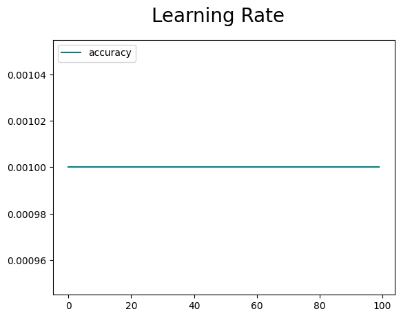
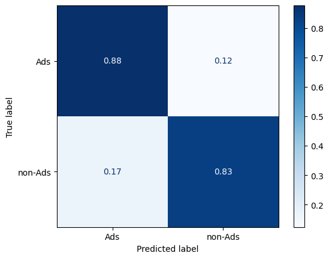
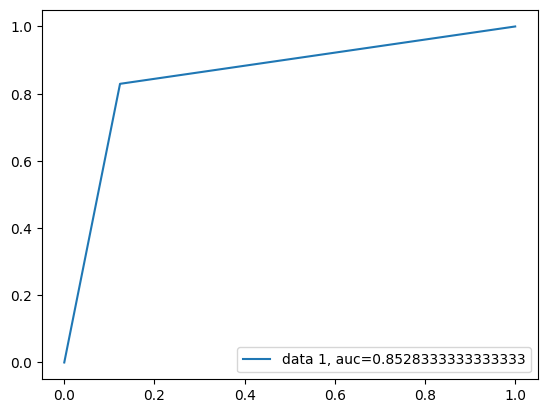
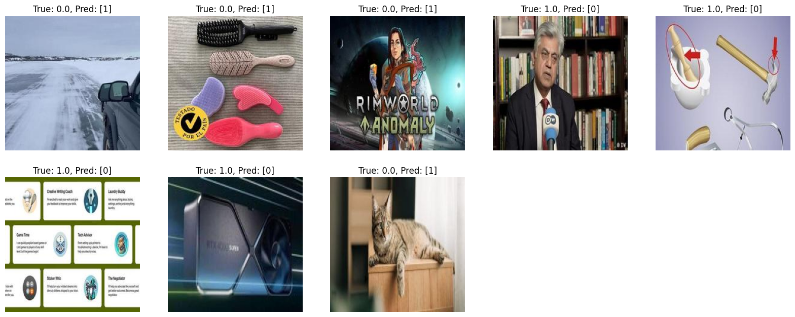
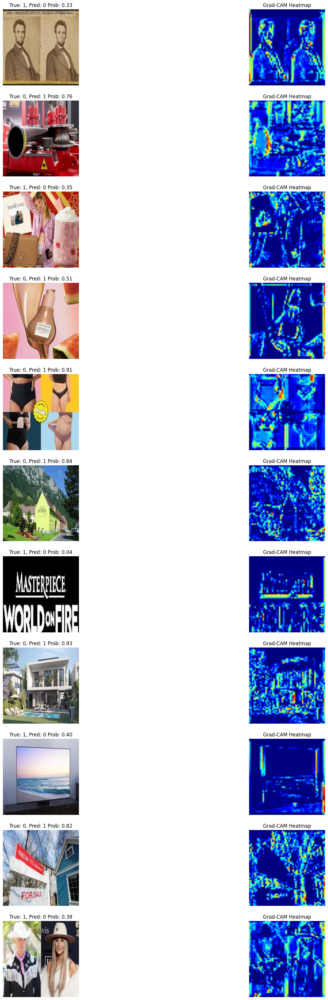
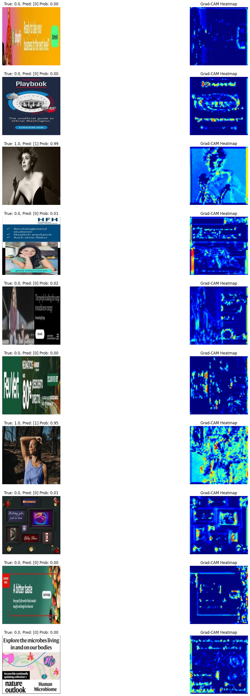

# The Custom network based on the AlexNet architecture

## Imports


```python
#!pip install "tensorflow<2.11"
#!pip install tensorflow tensorflow-gpu opencv-python matplotlib
#!pip install torchvision
#!pip install tensorflor keras
#!pip install scikit-plot
```


```python
# Standard library imports
import os
from os import walk, listdir
from os.path import isfile, join

import glob
import random
from random import shuffle
import time
```


```python
# Third-party imports
import numpy as np
from matplotlib import pyplot as plt

import tensorflow as tf
from tensorflow.keras.models import Sequential
from tensorflow.keras.layers import Conv2D, MaxPooling2D, Dense, Flatten ,Dropout, BatchNormalization
from tensorflow.keras.models import Model
from tensorflow.keras.preprocessing import image
from tensorflow.keras.utils import img_to_array, array_to_img,  load_img

import keras
from keras.models import load_model
from keras import optimizers
from keras.regularizers import l2
from keras.callbacks import EarlyStopping, ReduceLROnPlateau
from keras.preprocessing.image import ImageDataGenerator

from PIL import ImageEnhance

from sklearn import metrics
from sklearn.metrics import confusion_matrix, ConfusionMatrixDisplay, precision_score, recall_score, roc_auc_score, f1_score, roc_curve, auc
```


```python
!nvidia-smi
```


```python
gpus = tf.config.experimental.list_physical_devices('GPU')
gpus
```


    []


```python
print("Num GPUs Available: ", len(tf.config.list_physical_devices('GPU')))
```

    Num GPUs Available:  0
    

# Load Data


```python
import configparser

config = configparser.ConfigParser()
config.read('config.ini')

base_dir = config['DEFAULT']['base_dir']
print("Base Directory:", base_dir)
```


```python
Current_dir = os.getcwd()
Current_dir
```

# Split Data


```python
train_dir = os.path.join(base_dir, 'train')
validation_dir = os.path.join(base_dir, 'validation')
test_dir = os.path.join(base_dir, 'test')
```


```python
train_Ads_dir = os.path.join(train_dir, 'Ads')
train_sample_dir = os.path.join(train_dir, 'Sample')
train_sample_dir
```


```python
validation_Ads_dir = os.path.join(validation_dir, 'Ads')
validation_sample_dir = os.path.join(validation_dir, 'Sample')
validation_Ads_dir
```


```python
test_Ads_dir = os.path.join(test_dir, 'Ads')
test_sample_dir = os.path.join(test_dir, 'Sample')
test_Ads_dir
```


```python
print('total training Ads images:', len(os.listdir(train_Ads_dir)))
```

    total training Ads images: 10500
    


```python
print('total training sample images:', len(os.listdir(train_sample_dir)))
```

    total training sample images: 10500
    


```python
print('total validation Ads images:', len(os.listdir(validation_Ads_dir)))
```

    total validation Ads images: 3650
    


```python
print('total validation sample images:', len(os.listdir(validation_sample_dir)))
```

    total validation sample images: 3950
    


```python
print('total test Ads images:', len(os.listdir(test_Ads_dir)))
```

    total test Ads images: 3000
    


```python
print('total test sample images:', len(os.listdir(test_sample_dir)))
```

    total test sample images: 3000
    

# Config Class


```python
class TrainingConfig:
    """Configuration for training the CNN model."""
    BATCH_SIZE:       int   = 64
    EPOCHS:           int   = 100
    LEARNING_RATE:    float = 0.001
    DROPOUT:          float = 0.5
    LAYERS_FINE_TUNE: int   = 8
    EPSILON:          float = 1e-07
    MOMENTUM:         float = 0.9   
    WEIGHT_DECAY:     float = 0.0005 
```

# Model


```python
SEED = 42 # to always get same dropout and shuffle
```


```python
def allcnn(input_shape=(224, 224, 3)):

    """Builds the CNN model based on the architecture defined in the function.

    Args:
        input_shape (tuple): Shape of the input images.

    Returns:
        model (tf.keras.Model): Compiled CNN model.
                
    """


    model = Sequential()
    model.add(Conv2D(32, (3,3), 1, padding = 'same', activation='relu', input_shape=input_shape))
    model.add(MaxPooling2D())
    model.add(BatchNormalization())

    model.add(Conv2D(64, (3,3), 1, padding = 'same', activation='relu'))
    model.add(MaxPooling2D())
    model.add(BatchNormalization())


    model.add(Conv2D(128, (3,3), 1, padding = 'same', activation='relu'))
    model.add(MaxPooling2D())
    model.add(BatchNormalization())

    model.add(Dropout(TrainingConfig.DROPOUT, seed=SEED))
    model.add(Flatten())
    model.add(Dense(256, activation='relu', kernel_regularizer=l2(0.01))) 
    model.add(BatchNormalization())
    model.add(Dropout(TrainingConfig.DROPOUT, seed=SEED))
    model.add(Dense(1, activation='sigmoid'))

    adagrad = optimizers.Adagrad(learning_rate=TrainingConfig.LEARNING_RATE, initial_accumulator_value=0.1, epsilon=TrainingConfig.EPSILON)
    model.compile(optimizer = adagrad, loss=tf.losses.BinaryCrossentropy(), metrics=['accuracy'])

    # return model
    return model
```


```python
early_stopping = EarlyStopping(monitor='val_loss', patience=3)
```


```python
reduce_lr = ReduceLROnPlateau(monitor='val_loss', factor=0.2, patience=2, min_lr=0.001) #Factor by which the learning rate will be reduced
```


```python
# build model
model = allcnn()
```


```python
model.summary()
```

    Model: "sequential"
    _________________________________________________________________
     Layer (type)                Output Shape              Param #   
    =================================================================
     conv2d (Conv2D)             (None, 224, 224, 32)      896       
                                                                     
     max_pooling2d (MaxPooling2D  (None, 112, 112, 32)     0         
     )                                                               
                                                                     
     batch_normalization (BatchN  (None, 112, 112, 32)     128       
     ormalization)                                                   
                                                                     
     conv2d_1 (Conv2D)           (None, 112, 112, 64)      18496     
                                                                     
     max_pooling2d_1 (MaxPooling  (None, 56, 56, 64)       0         
     2D)                                                             
                                                                     
     batch_normalization_1 (Batc  (None, 56, 56, 64)       256       
     hNormalization)                                                 
                                                                     
     conv2d_2 (Conv2D)           (None, 56, 56, 128)       73856     
                                                                     
     max_pooling2d_2 (MaxPooling  (None, 28, 28, 128)      0         
     2D)                                                             
                                                                     
     batch_normalization_2 (Batc  (None, 28, 28, 128)      512       
     hNormalization)                                                 
                                                                     
     dropout (Dropout)           (None, 28, 28, 128)       0         
                                                                     
     flatten (Flatten)           (None, 100352)            0         
                                                                     
     dense (Dense)               (None, 256)               25690368  
                                                                     
     batch_normalization_3 (Batc  (None, 256)              1024      
     hNormalization)                                                 
                                                                     
     dropout_1 (Dropout)         (None, 256)               0         
                                                                     
     dense_1 (Dense)             (None, 1)                 257       
                                                                     
    =================================================================
    Total params: 25,785,793
    Trainable params: 25,784,833
    Non-trainable params: 960
    _________________________________________________________________
    

## Using data augmentation


```python
# Custom preprocessing function for color augmentation
def color_jitter(image):
    image = ImageEnhance.Brightness(image).enhance(np.random.uniform(0.6, 1.4))
    image = ImageEnhance.Contrast(image).enhance(np.random.uniform(0.6, 1.4))
    image = ImageEnhance.Color(image).enhance(np.random.uniform(0.6, 1.4))
    return image
```


```python
# Custom preprocessing function for ImageDataGenerator
def custom_preprocessing_function(image):
    # Convert array to PIL image
    image = array_to_img(image)
    # Apply color jitter
    image = color_jitter(image)
    # Convert PIL image back to array
    image = img_to_array(image)
    return image
```


```python
train_datagen = ImageDataGenerator(
    rescale=1./255,
    rotation_range=40,
    width_shift_range=0.2,
    height_shift_range=0.2,
    shear_range=0.2,
    zoom_range=0.2,
    horizontal_flip=True,
    fill_mode='nearest',
    preprocessing_function=custom_preprocessing_function)

# Note that the validation data should not be augmented!
test_datagen = ImageDataGenerator(rescale=1./255)

train_generator = train_datagen.flow_from_directory(
        # This is the target directory
        train_dir,
        # All images will be resized to 224x224
        target_size=(224, 224),
        batch_size=TrainingConfig.BATCH_SIZE, #64
        # Since we use binary_crossentropy loss, we need binary labels
        class_mode='binary')

validation_generator = test_datagen.flow_from_directory(
        validation_dir,
        target_size=(224, 224),
        batch_size=TrainingConfig.BATCH_SIZE,
        class_mode='binary')
```

    Found 21000 images belonging to 2 classes.
    Found 7600 images belonging to 2 classes.
    

# Train


```python
len(train_generator)
len(validation_generator)

epochs_len = len(train_generator)
Val_len = len(validation_generator)
print("Epochs len: ", epochs_len)
print("Val len: ", Val_len)
```

    Epochs len:  329
    Val len:  119
    


```python
checkpoint_dir = config['PATHS']['checkpoint_dir']
```


```python
# Adding checkpoint to store the model on the best epoch for Val acc.
checkpoint_filepath = os.path.join(checkpoint_dir, 'model_AlexNet-{epoch:02d}-{val_accuracy:.4f}.keras')
model_checkpoint_callback = keras.callbacks.ModelCheckpoint(
    filepath=checkpoint_filepath,
    monitor='val_accuracy',
    mode='max',
    save_best_only=True,
    verbose = 1)
```


```python
start_time = time.time()
```


```python
hist = model.fit(    #fit_generator
      train_generator,
      #steps_per_epoch=epochs_len,
      epochs=TrainingConfig.EPOCHS,
      validation_data=validation_generator,
      #validation_steps=Val_len,
      callbacks=[model_checkpoint_callback, reduce_lr, early_stopping]) 
```


```python
print("--- %s Training set > seconds ---" % (time.time() - start_time))
```


```python
Current_dir = os.getcwd()
Current_dir
```


```python
val_acc_per_epoch = hist.history['val_accuracy']
best_epoch = val_acc_per_epoch.index(max(val_acc_per_epoch)) + 1
print('Best epoch: %d' % (best_epoch,))


val_loss_per_epoch = hist.history['val_loss']
min_loss_epoch = val_loss_per_epoch.index(min(val_loss_per_epoch)) + 1

print('Min Val Loss epoch: %d' % (min_loss_epoch,))

```


```python
fig = plt.figure()
plt.plot(hist.history['loss'][1:], color='teal', label='loss')
plt.plot(hist.history['val_loss'][1:], color='orange', label='val_loss')
fig.suptitle('Loss', fontsize=20)
plt.legend(loc="upper left")
plt.show()
```


    

    


```python
fig = plt.figure()
plt.plot(hist.history['accuracy'], color='teal', label='accuracy')
plt.plot(hist.history['val_accuracy'], color='orange', label='val_accuracy')
fig.suptitle('Accuracy', fontsize=20)
plt.legend(loc="upper left")
plt.show()
```


    

    


```python
print(hist.history.keys())
```

    dict_keys(['loss', 'accuracy', 'val_loss', 'val_accuracy', 'lr'])
    


```python
fig = plt.figure()
plt.plot(hist.history['lr'], color='teal', label='accuracy')
#plt.plot(hist.history['val_accuracy'], color='orange', label='val_accuracy')
fig.suptitle('Learning Rate', fontsize=20)
plt.legend(loc="upper left")
plt.show()
```


    

    


# Loading best epoch in our model using the checkpoints


```python
print('Best epoch: %d' % (best_epoch,))
```

    Best epoch: 86
    


```python
best_val_accuracy = max(val_acc_per_epoch)
#min_val_loss = min(val_loss_per_epoch)
best_model_file = f'model-{best_epoch:02d}-{best_val_accuracy:.4f}.keras'

print(f'Best model file: {best_model_file}')
```

    Best model file: model-86-0.8629.keras
    


```python
model_dir= checkpoint_dir
```


```python
# Construct the full path to the best model file
best_model_path = os.path.join(model_dir, best_model_file)
best_model_path
```


```python
os.chdir(model_dir)
```


```python
Current_dir = os.getcwd()
Current_dir
```


    'C:\\Users\\YannisPC\\PycharmProjects\\Thesis\\Thesis\\checkpoints'


```python
onlyfiles = [f for f in listdir(model_dir) if isfile(join(model_dir, f))]
onlyfiles
```


```python
#loaded_model = load_model(os.path.join('checkpoints',best_model_file))
loaded_model = load_model('model_AlexNet-86-0.8629.keras') 
loaded_model.summary()
```

    Model: "sequential"
    _________________________________________________________________
     Layer (type)                Output Shape              Param #   
    =================================================================
     conv2d (Conv2D)             (None, 224, 224, 32)      896       
                                                                     
     max_pooling2d (MaxPooling2D  (None, 112, 112, 32)     0         
     )                                                               
                                                                     
     batch_normalization (BatchN  (None, 112, 112, 32)     128       
     ormalization)                                                   
                                                                     
     conv2d_1 (Conv2D)           (None, 112, 112, 64)      18496     
                                                                     
     max_pooling2d_1 (MaxPooling  (None, 56, 56, 64)       0         
     2D)                                                             
                                                                     
     batch_normalization_1 (Batc  (None, 56, 56, 64)       256       
     hNormalization)                                                 
                                                                     
     conv2d_2 (Conv2D)           (None, 56, 56, 128)       73856     
                                                                     
     max_pooling2d_2 (MaxPooling  (None, 28, 28, 128)      0         
     2D)                                                             
                                                                     
     batch_normalization_2 (Batc  (None, 28, 28, 128)      512       
     hNormalization)                                                 
                                                                     
     dropout (Dropout)           (None, 28, 28, 128)       0         
                                                                     
     flatten (Flatten)           (None, 100352)            0         
                                                                     
     dense (Dense)               (None, 256)               25690368  
                                                                     
     batch_normalization_3 (Batc  (None, 256)              1024      
     hNormalization)                                                 
                                                                     
     dropout_1 (Dropout)         (None, 256)               0         
                                                                     
     dense_1 (Dense)             (None, 1)                 257       
                                                                     
    =================================================================
    Total params: 25,785,793
    Trainable params: 25,784,833
    Non-trainable params: 960
    _________________________________________________________________
    

# Evaluate


```python
start_time = time.time()
```


```python
test_generator = test_datagen.flow_from_directory(
        test_dir,
        target_size=(224, 224),
        batch_size=TrainingConfig.BATCH_SIZE,
        class_mode='binary')

test_loss, test_acc = loaded_model.evaluate(test_generator, steps=len(test_generator))  # steps_per_epoch * epochs
print('test acc:', test_acc)
print('test loss:', test_loss)
```

    Found 6000 images belonging to 2 classes.
    94/94 [==============================] - 13s 135ms/step - loss: 0.7468 - accuracy: 0.8528
    test acc: 0.8528333306312561
    test loss: 0.7468059659004211
    


```python
print("--- %s Training set > seconds ---" % (time.time() - start_time))
```

    --- 13.43484091758728 Training set > seconds ---
    

Confution Matrix


```python
# Initialize lists to collect true labels and predictions
true_labels = []
predicted_labels = []
```


```python
for _ in range(len(test_generator)):
    X, y = next(test_generator)

    yhat = loaded_model.predict(X)
    
    y_true_batch = y # Labels
    
    # Convert probabilities to class labels using a threshold of 0.5
    y_pred_batch = (yhat > 0.5).astype(int)

    # Append the true labels and predictions for this batch to the lists
    true_labels.extend(y_true_batch)
    predicted_labels.extend(y_pred_batch)

    if len(true_labels) >= test_generator.n:
        break
   
```


```python
# Convert lists to numpy arrays
true_labels = np.array(true_labels)
predicted_labels = np.array(predicted_labels)
```


```python
# Compute the confusion matrix
cm = confusion_matrix(true_labels, predicted_labels)
```


```python
cm
```


    array([[2629,  371],
           [ 512, 2488]], dtype=int64)


Ads = 0 

non-Ads= 1


```python
# Plot the confusion matrix
cm_sum = np.sum(cm, axis=1, keepdims=True)
disp = ConfusionMatrixDisplay(confusion_matrix=cm/cm_sum.astype(float), display_labels=['Ads', 'non-Ads'])
disp.plot(cmap=plt.cm.Blues)
plt.show()
```


    

    


```python
f1_score(true_labels, predicted_labels)
```


    0.8492916880013655


```python
# precision tp / (tp + fp)
precision = precision_score(true_labels, predicted_labels)
precision
```


    0.8702343476740119


```python
# recall: tp / (tp + fn)
recall = recall_score(true_labels, predicted_labels)
recall
```


    0.8293333333333334


```python
# ROC AUC
auc = roc_auc_score(true_labels, predicted_labels)
print('ROC AUC: %f' % auc)
```

    ROC AUC: 0.852833
    


```python
auc = metrics.roc_auc_score(true_labels, predicted_labels)
```


```python
fpr_imbalanced, tpr_imbalanced, _ = roc_curve(true_labels, predicted_labels)
```


```python
plt.plot(fpr_imbalanced,tpr_imbalanced,label="data 1, auc="+str(auc))
plt.legend(loc=4)
plt.show()
```


    

    


# Visualizing Falsely Identified Images


```python
# Assuming the test_generator, modelPreTConvNTiny, true_labels, and predicted_labels are defined

# Initialize lists to store images, true labels, and predicted labels
falsely_identified_images = []
falsely_identified_true_labels = []
falsely_identified_predicted_labels = []

```


```python
# Function to plot falsely identified images
def plot_falsely_identified_images(images, true_labels, predicted_labels, num_images=10):
    plt.figure(figsize=(20, 20))
    for i in range(min(num_images, len(images))):
        ax = plt.subplot(5, 5, i + 1)
        plt.imshow(images[i]) #.astype(np.uint8)
        plt.title(f'True: {true_labels[i]}, Pred: {predicted_labels[i]}')
        plt.axis('off')
    plt.show()
```

Visualize a specific batch


```python
len(test_generator)
```


    94


```python
# Choose a specific batch index
batch_index = 42  
```


```python
# Get the specific batch
X, y = test_generator[batch_index]

# Make predictions on the specific batch
yhat = loaded_model.predict(X)

# Convert probabilities to class labels using a threshold of 0.5
y_pred_batch = (yhat > 0.5).astype(int)
```

    2/2 [==============================] - 0s 14ms/step
    


```python
falsely_identified_images = []
falsely_identified_true_labels = []
falsely_identified_predicted_labels = []

```


```python
# Compare true labels with predictions and collect the false ones
for i in range(len(y)):
    #print("Y[i]: Pred[i]", y[i], y_pred_batch[i])
    y_true = int(y[i])
    y_pred = int(y_pred_batch[i])
    if y_true != y_pred:  # if not np.array_equal(y[i], y_pred_batch[i]):
        print("Y[i]: Pred[i]", y[i], y_pred_batch[i])
        falsely_identified_images.append(X[i])
        falsely_identified_true_labels.append(y[i])
        falsely_identified_predicted_labels.append(y_pred_batch[i])
```

Ads = 0 

non-Ads = 1


```python
# Plotting the first 25 falsely identified images
plot_falsely_identified_images(
    falsely_identified_images,
    falsely_identified_true_labels,
    falsely_identified_predicted_labels,
    num_images=25)
```


    

    


# Visuallize the regions of the image that trigered the false classification


```python
def get_img_array(img, size):
    # `img` is a PIL image of size 224x224
    img = tf.keras.preprocessing.image.img_to_array(img)
    # We add a dimension to transform our array into a "batch"
    img = np.expand_dims(img, axis=0)
    return img
```


```python
def make_gradcam_heatmap(img_array, model, last_conv_layer_name, pred_index=None):
    # First, we create a model that maps the input image to the activations of the last conv layer as well as the output predictions
    # 
    grad_model = Model(
        [model.inputs], [model.get_layer(last_conv_layer_name).output, model.output]
    )
    
    # We compute the gradient of the top predicted class for our input image
    # with respect to the activations of the last conv layer
    with tf.GradientTape() as tape:
        last_conv_layer_output, preds = grad_model(img_array)
        if pred_index is None:
            pred_index = tf.argmax(preds[0])
        class_channel = preds[:, pred_index]
    
    # This is the gradient of the output neuron (top predicted or chosen)
    # with regard to the output feature map of the last conv layer
    grads = tape.gradient(class_channel, last_conv_layer_output)
    
    # This is a vector where each entry is the mean intensity of the gradient
    # over a specific feature map channel
    pooled_grads = tf.reduce_mean(grads, axis=(0, 1, 2))
    
    # We multiply each channel in the feature map array
    # by "how important this channel is" with regard to the top predicted class
    last_conv_layer_output = last_conv_layer_output[0]
    heatmap = last_conv_layer_output @ pooled_grads[..., tf.newaxis]
    heatmap = tf.squeeze(heatmap)
    
    # For visualization purpose, we will also normalize the heatmap between 0 & 1
    heatmap = tf.maximum(heatmap, 0) / tf.math.reduce_max(heatmap)
    return heatmap.numpy()
```


```python
def plot_falsely_identified_images(images, true_labels, predicted_labels, prediction_probs, model, last_conv_layer_name, num_images=10): #=10
    num_images = min(num_images, len(images))
    #plt.figure(figsize=(20, 20))
    plt.figure(figsize=(20, 4 * num_images))
    for i in range(min(num_images, len(images))):
        img_array = np.expand_dims(images[i], axis=0)
        heatmap = make_gradcam_heatmap(img_array, model, last_conv_layer_name)
        
        # Original Image
        #ax = plt.subplot(5, 2, 2*i + 1)
        ax = plt.subplot(num_images, 2, 2*i + 1)
        plt.imshow(images[i])
        plt.title(f'True: {true_labels[i]}, Pred: {predicted_labels[i]} Prob: {prediction_probs[i]:.2f}')
        plt.axis('off')
        
        # Heatmap Image
        img = image.array_to_img(images[i])
        heatmap = np.uint8(255 * heatmap)
        jet = plt.cm.get_cmap("jet")
        jet_colors = jet(np.arange(256))[:, :3]
        jet_heatmap = jet_colors[heatmap]
        jet_heatmap = tf.keras.preprocessing.image.array_to_img(jet_heatmap)
        jet_heatmap = jet_heatmap.resize((img.size[0], img.size[1]))
        jet_heatmap = tf.keras.preprocessing.image.img_to_array(jet_heatmap)
        superimposed_img = jet_heatmap * 0.4 + images[i]
        superimposed_img = tf.keras.preprocessing.image.array_to_img(superimposed_img)
        
        #ax = plt.subplot(5, 2, 2*i + 2)
        ax = plt.subplot(num_images, 2, 2*i + 2)
        plt.imshow(superimposed_img)
        plt.title('Grad-CAM Heatmap')
        plt.axis('off')
    plt.show()
```


```python
batch_index = 21

X, y = test_generator[batch_index]
yhat = loaded_model.predict(X)
y_pred_batch = (yhat > 0.5).astype(int)

falsely_identified_images = []
falsely_identified_true_labels = []
falsely_identified_predicted_labels = []
falsely_identified_float_prediction = []

for i in range(len(y)):
    y_true = int(y[i])
    y_pred = int(y_pred_batch[i])
    if y_true != y_pred:
        falsely_identified_images.append(X[i])
        falsely_identified_true_labels.append(y_true)
        falsely_identified_predicted_labels.append(y_pred)
        
        # to show the prediction in float
        falsely_identified_float_prediction.append(yhat[i][0])

last_conv_layer_name = 'conv2d_2'
```


```python
plot_falsely_identified_images(
    falsely_identified_images,
    falsely_identified_true_labels,
    falsely_identified_predicted_labels,
    falsely_identified_float_prediction,
    loaded_model,
    last_conv_layer_name,
    num_images=15
    )
```

    C:\Users\YannisPC\AppData\Local\Temp\ipykernel_13468\3574830798.py:19: MatplotlibDeprecationWarning: The get_cmap function was deprecated in Matplotlib 3.7 and will be removed two minor releases later. Use ``matplotlib.colormaps[name]`` or ``matplotlib.colormaps.get_cmap(obj)`` instead.
      jet = plt.cm.get_cmap("jet")
    


    

    


## Visualizing the Heatmap of correctly identified images


```python
correclty_identified_images = []
correclty_identified_true_labels = []
correclty_identified_predicted_labels = []
correclty_identified_float_prediction = []
```


```python
batch_index = 21

X, y = test_generator[batch_index]
yhat = loaded_model.predict(X)
y_pred_batch = (yhat > 0.5).astype(int)

# Compare true labels with predictions and collect the false ones
for i in range(len(y)):
    #print("Y[i]: Pred[i]", y[i], y_pred_batch[i])
    y_true = int(y[i])
    y_pred = int(y_pred_batch[i])

    if  yhat[i][0] >= 0.9 or yhat[i][0] <= 0.1:           #    y_true == y_pred:  
        print("Y[i]: Pred[i], prob", y[i], y_pred_batch[i], yhat[i][0])
        correclty_identified_images.append(X[i])
        correclty_identified_true_labels.append(y[i])
        correclty_identified_predicted_labels.append(y_pred_batch[i])
        # to show the prediction in float
        correclty_identified_float_prediction.append(yhat[i][0])

last_conv_layer_name = 'conv2d_2'        
```


```python
# plot a few Ads and a Few regular images to show the heatmap
plot_falsely_identified_images(
    correclty_identified_images,
    correclty_identified_true_labels,
    correclty_identified_predicted_labels,
    correclty_identified_float_prediction,
    loaded_model,
    last_conv_layer_name,
    num_images=10
    )
```

    C:\Users\YannisPC\AppData\Local\Temp\ipykernel_13468\3574830798.py:19: MatplotlibDeprecationWarning: The get_cmap function was deprecated in Matplotlib 3.7 and will be removed two minor releases later. Use ``matplotlib.colormaps[name]`` or ``matplotlib.colormaps.get_cmap(obj)`` instead.
      jet = plt.cm.get_cmap("jet")
    


    

    

